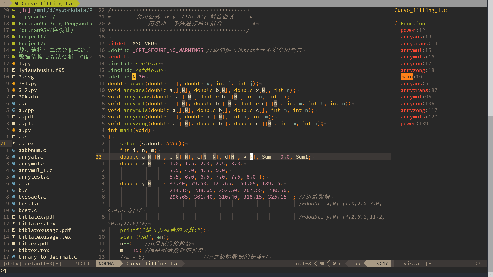
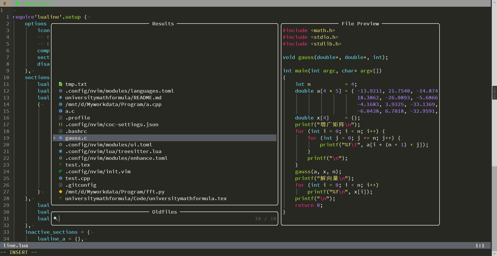

# Neovim配置

我的一些nvim配置

## 目录结构
```
├── README.md
├── autoload
│   ├── function.vim
│   ├── initself.vim
│   └── theme.vim
├── coc-settings.json
├── config
│   └── plugins
│       └── asyncrun.vim
├── core
│   ├── core.vim
│   ├── dein.vim
│   ├── event.vim
│   ├── general.vim
│   ├── pmap.vim
│   └── vmap.vim
├── fig
│   ├── compe.png
│   ├── config.png
│   ├── fuzzy.png
│   ├── lsp.png
│   └── program.png
├── ftdetect
│   ├── gnuplot.vim
│   └── perl.vim
├── gtags.conf
├── init.vim
├── installer.sh
├── lua
│   ├── complete.lua
│   ├── line.lua
│   ├── lsp.lua
│   ├── nvimtree.lua
│   └── treesitter.lua
├── modules
│   ├── completion.toml
│   ├── enhance.toml
│   ├── fuzzyfind.toml
│   ├── languages.toml
│   ├── program.toml
│   ├── textobj.toml
│   └── ui.toml
├── plugin
│   ├── difftools.vim
│   ├── hlsearch.vim
│   ├── nicefold.vim
│   └── whitespace.vim
└── snips
    ├── toml.json
    └── toml.snippets
```

## 插件管理器
插件管理器是`dein`
## 主题
主题使用的`gruvbox`
文件数用的`defx`


## 补全
使用neovim的内置lsp和`lspsaga`增强,用`nvim-compe`+`vsnip`补全


## 查找
使用`vim-clap`

